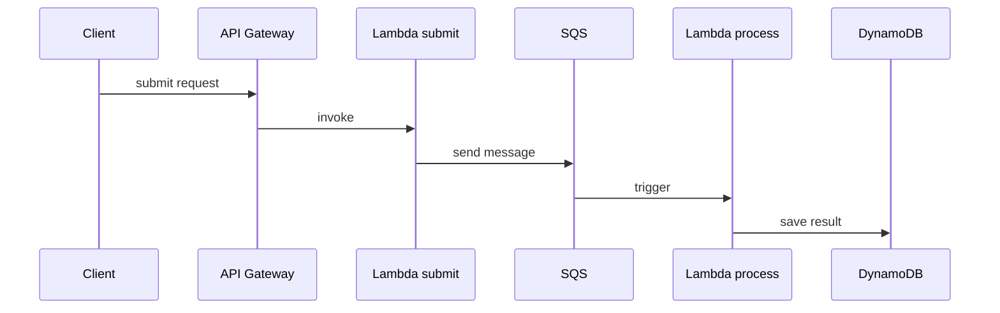
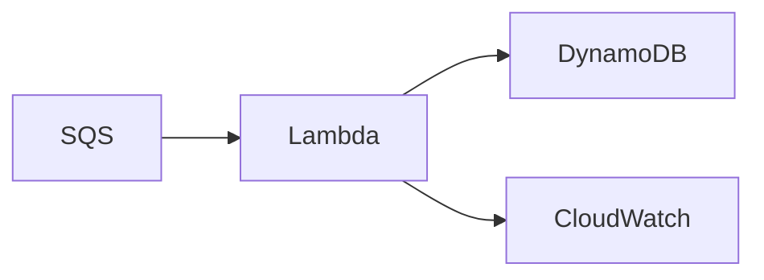

# AWS Price Change Audit

Project implementing a small event-driven architecture on AWS.

## Goal

Practice core AWS serverless services:

- API Gateway
- Lambda
- SQS
- DynamoDB

## Architecture

## Components

### API Gateway
API Gateway exposes HTTP endpoints for submitting a product price change and retrieving price history. It acts as the public entry point to the system and forwards requests to Lambda handlers.

### Submit Lambda
The submit Lambda handles incoming price change requests. It parses and validates the request body, creates a `PriceChangeEvent`, sends it to the SQS queue, and returns `202 Accepted`. It does not write directly to DynamoDB.

### SQS Queue
SQS is used to decouple request submission from event processing. This makes the system asynchronous and allows the write operation to be handled independently from the initial API request.

### Process Lambda
The process Lambda is triggered by SQS messages. It reads the `PriceChangeEvent`, transforms it into a DynamoDB item, and persists it as an audit record.

### DynamoDB
DynamoDB stores the history of product price changes. The table is designed to support efficient reads of all price changes for a given product, ordered by time.

### Get Price History Lambda
This Lambda handles read requests for product price history. It queries DynamoDB using the product identifier and returns the audit records to the caller.

## Flow

1. Client submits price change request
2. API publishes event to SQS
3. Lambda processes event
4. Event is stored in DynamoDB as audit history
5. Client can retrieve price change history

## Why this architecture?

This project uses an event-driven flow to separate request handling from persistence.

Benefits:
- loose coupling between submission and processing
- simpler async processing model
- good fit for serverless AWS services

Trade-offs:
- eventual consistency
- more moving parts than a direct synchronous write
- more AWS configuration than a simple CRUD app

### Eventual Consistency

The system uses asynchronous processing through SQS.  
When a price change is submitted, the API accepts the request and publishes an event to the queue.

The actual database update happens later when the processing Lambda consumes the message.

This means the system is **eventually consistent**: a recently submitted price change might not be visible immediately in the history endpoint, but it will appear shortly after the event is processed.

## Async processing

## Endpoints

POST /products/{productId}/price-changes  
GET /products/{productId}/price-history