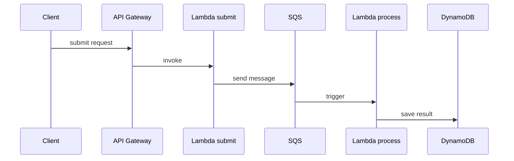
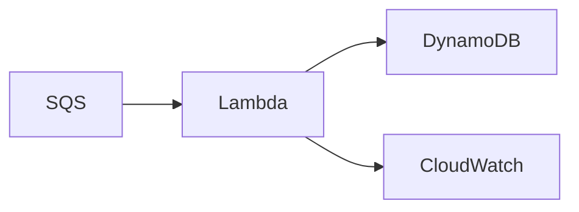

# AWS Price Change Audit

Project implementing a small event-driven architecture on AWS.

## Goal

Practice core AWS serverless services:

- API Gateway
- Lambda
- SQS
- DynamoDB

## Architecture

## Flow

1. Client submits price change request
2. API publishes event to SQS
3. Lambda processes event
4. Event is stored in DynamoDB as audit history
5. Client can retrieve price change history

## Async processing

## Endpoints

POST /products/{productId}/price-changes  
GET /products/{productId}/price-history