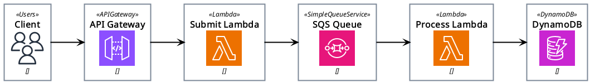
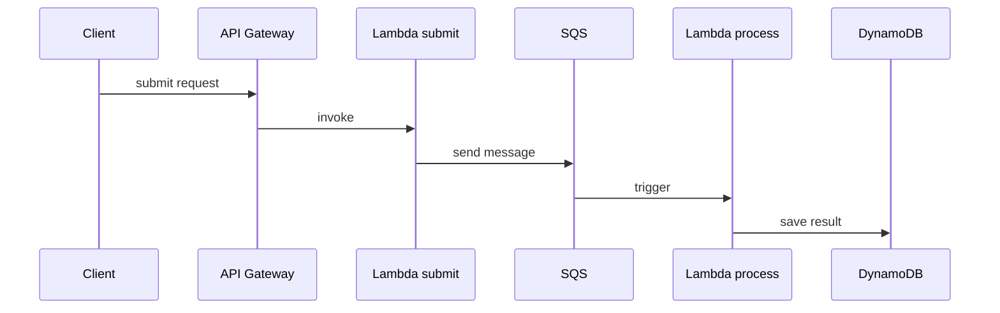
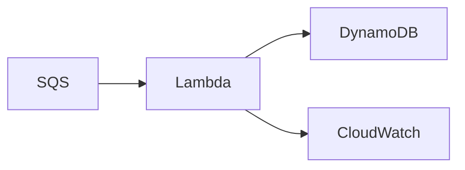

# AWS Price Change Audit

A small event-driven AWS project for tracking product price changes.

## Goal

This project is intended to practice core AWS serverless services:

- API Gateway
- Lambda
- SQS
- DynamoDB

## Architecture


## Components

### API Gateway
API Gateway exposes HTTP endpoints for:

- submitting a product price change
- retrieving product price history

It serves as the public entry point and forwards requests to Lambda handlers.

### Submit Lambda

The submit Lambda handles incoming price change requests. It:

- parses and validates the request body
- creates a `ProductPriceChanged` event
- sends the event to SQS
- returns `202 Accepted`

It does not write directly to DynamoDB.

### SQS Queue

SQS decouples request submission from event processing. This makes the system asynchronous and allows persistence to happen independently of the initial API request.

### Process Lambda

The process Lambda is triggered by SQS messages. It reads the `ProductPriceChanged` event, transforms it into a DynamoDB item, and stores it as an audit record.

### DynamoDB

DynamoDB stores the history of product price changes. The table is designed to support efficient retrieval of all price changes for a given product, ordered by time.

### Get Price History Lambda

This Lambda handles read requests for product price history. It queries DynamoDB using the product identifier and returns the audit records.

## Flow

1. A client submits a price change request.
2. API Gateway invokes the submit Lambda.
3. The submit Lambda publishes an event to SQS.
4. The process Lambda consumes the event from SQS.
5. The process Lambda stores the audit record in DynamoDB.
6. The client can retrieve price change history through the read endpoint.


## Why this architecture?

This project uses an event-driven flow to separate request handling from persistence.

Benefits:
- loose coupling between submission and processing
- simpler async processing model
- good fit for serverless AWS services

Trade-offs:
- eventual consistency
- more moving parts than a direct synchronous write
- more AWS configuration than a simple CRUD app

### Eventual Consistency

The system uses asynchronous processing through SQS.
When a price change is submitted, the API accepts the request and publishes an event to the queue.

The actual database update happens later when the processing Lambda consumes the message.

This means the system is **eventually consistent**: a recently submitted price change might not be visible immediately in the history endpoint, but it will appear shortly after the event is processed.

## Async processing

## Event contract

The system publishes the `ProductPriceChanged` event to SQS as a JSON payload.

Schema definition:
- `schemas/events/product-price-changed.yaml`

## Example event payload

```json
{
  "eventId": "evt-3a41d6d0-7a3f-4c7e-8c75-3d2c1a8d0b2e",
  "occurredAt": "2026-03-08T18:00:00Z",
  "productId": "PROD-123",
  "oldPrice": {
    "amount": 199.99,
    "currency": "PLN"
  },
  "newPrice": {
    "amount": 179.99,
    "currency": "PLN"
  },
  "changedBy": "admin-user",
  "reason": "spring-promo"
}
```

## Endpoints
### Submit price change
Endpoint: `POST /products/{productId}/price-changes`

### Get price history
Endpoint: `GET /products/{productId}/price-history`
